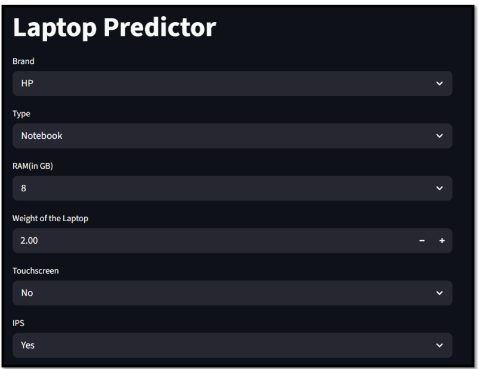
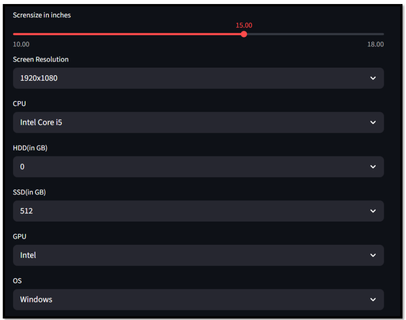
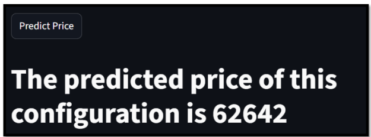

# 💻 Laptop Price Prediction | Machine Learning

## 📌 Project Overview

The **Laptop Price Prediction System** is an end-to-end machine learning project designed to estimate laptop prices based on hardware specifications and other product characteristics.

The project covers the complete machine learning workflow — from **data preprocessing and exploratory data analysis (EDA)** to **feature engineering, model experimentation, model evaluation, and prediction**.

A lightweight **Streamlit interface** was developed as the presentation layer, allowing users to enter laptop specifications and receive an estimated price from the trained machine learning pipeline.

---

## 🎯 Problem Statement

Laptop prices vary considerably depending on factors such as brand, processor, RAM, storage, GPU, display characteristics, operating system, and other hardware specifications.

This makes it difficult to estimate whether a particular configuration is appropriately priced.

The objective of this project is to build a **data-driven regression model** that learns relationships between laptop specifications and historical prices and uses those patterns to estimate the price of a given configuration.

---

## 🎯 Project Objectives

- Clean and preprocess raw laptop data
- Perform exploratory data analysis to understand pricing patterns
- Engineer meaningful features from raw hardware specifications
- Analyze relationships between laptop characteristics and price
- Train and compare multiple regression algorithms
- Evaluate models using regression metrics
- Build a reusable machine learning prediction pipeline
- Create a simple user interface for generating predictions
- Demonstrate an end-to-end machine learning workflow

---

## 🛠️ Tech Stack

| Technology | Purpose |
|---|---|
| **Python** | Core programming language |
| **Pandas** | Data manipulation and preprocessing |
| **NumPy** | Numerical operations |
| **Matplotlib** | Data visualization |
| **Seaborn** | Exploratory data visualization |
| **Scikit-learn** | Preprocessing, model training and evaluation |
| **XGBoost** | Gradient-boosting model experimentation |
| **Jupyter Notebook** | EDA, feature engineering and model development |
| **Streamlit** | Lightweight prediction interface |
| **Pickle** | Model and processed-data serialization |

---

## 🔄 End-to-End Workflow

```text
Raw Laptop Dataset
        ↓
Data Cleaning
        ↓
Exploratory Data Analysis
        ↓
Feature Engineering
        ↓
Feature Transformation
        ↓
Train-Test Split
        ↓
Model Experimentation
        ↓
Model Evaluation
        ↓
Prediction Pipeline
        ↓
Model Serialization
        ↓
Streamlit Interface
        ↓
Laptop Price Prediction
```

---

## 🔍 Exploratory Data Analysis

Exploratory Data Analysis was performed to understand the structure of the laptop dataset and investigate relationships between different laptop specifications and price.

The analysis included:

- Price distribution
- Brand-level analysis
- Laptop type analysis
- RAM and price relationships
- CPU analysis
- GPU analysis
- Storage analysis
- Operating system analysis
- Screen and display characteristics
- Correlation analysis
- Identification of important pricing patterns

EDA helped guide the feature-engineering and model-development stages of the project.

---

## ⚙️ Feature Engineering

Several raw specifications required transformation before they could be effectively used for machine learning.

### RAM

RAM values were converted from text-based representations into numerical GB values.

### Weight

Laptop weight was converted into a numerical representation suitable for model training.

### Touchscreen

Touchscreen information was extracted from screen specifications and converted into a binary feature.

### IPS Display

IPS information was extracted and represented as a binary feature.

### PPI — Pixels Per Inch

Screen resolution and display size were combined to create **Pixels Per Inch (PPI)**:

```text
PPI = √(X_resolution² + Y_resolution²) / Screen Size
```

This provides a more meaningful representation of display pixel density than using resolution alone.

### CPU

Detailed processor descriptions were simplified into broader CPU categories to reduce unnecessary categorical complexity.

### Storage

Storage information was transformed into separate numerical features such as:

- HDD
- SSD

This allows the model to distinguish between different storage technologies and capacities.

### GPU

GPU information was simplified into meaningful GPU-brand categories.

### Operating System

Operating-system values were consolidated into broader OS categories for modeling.

---

## 🤖 Machine Learning Model Experimentation

Multiple regression algorithms were trained and evaluated rather than relying on a single model.

| Model | R² Score |
|---|---:|
| Linear Regression | 0.8073 |
| Ridge Regression | 0.8127 |
| Lasso Regression | 0.8072 |
| K-Nearest Neighbors | 0.8028 |
| Decision Tree | 0.8424 |
| Support Vector Regression | 0.8083 |
| Random Forest | **0.8873** |
| Extra Trees | 0.8754 |
| AdaBoost | 0.7979 |
| Gradient Boosting | 0.8821 |
| XGBoost | 0.8771 |
| Voting Regressor | **0.8898** |
| Stacking Regressor | 0.8808 |

> **Model comparison insight:** The Voting Regressor produced the highest R² score in the recorded notebook experiments at approximately **0.8898**, while Random Forest achieved a very similar **0.8873** and was used in the serialized prediction pipeline/application.

This distinction is important because model experimentation and the final application implementation are documented separately in the project.

---

## 🌲 Random Forest Prediction Pipeline

The application uses a machine learning pipeline containing preprocessing and a **Random Forest Regressor**.

The Random Forest configuration used in the project includes:

```text
n_estimators = 100
random_state = 3
max_samples = 0.5
max_features = 0.75
max_depth = 15
```

The pipeline combines feature preprocessing with the regression model so that incoming laptop specifications can be transformed and passed to the estimator consistently.

The target price was modeled using a logarithmic transformation, and the application applies the inverse transformation when displaying the final predicted price.

---

## 🏗️ System Design

### DFD Level 0 — Context Diagram


The Level 0 DFD presents the Laptop Price Prediction System at a high level. Laptop specifications are provided to the prediction system, which uses laptop data to generate a predicted price for the user.

### DFD Level 1 — High-Level Processes


The Level 1 DFD expands the system into major stages including:

1. Data acquisition and preprocessing
2. Model training and evaluation
3. Prediction service/interface
4. Deployment and hosting

> The DFD forms part of the academic project documentation and represents the designed system workflow. Deployment details may differ from the current repository configuration.

---

## 🖥️ Prediction Interface

A lightweight **Streamlit interface** was created to demonstrate the trained model in an interactive form.

Users can provide specifications including:

- Brand
- Laptop type
- RAM
- Weight
- Touchscreen
- IPS display
- Screen size
- Screen resolution
- CPU
- HDD capacity
- SSD capacity
- GPU
- Operating system

### Interface — Part 1



### Interface — Part 2



### Prediction Output



When the user clicks **Predict Price**, the application:

1. Converts the selected Touchscreen and IPS values into numerical features.
2. Extracts the X and Y screen resolution.
3. Calculates PPI from resolution and screen size.
4. Creates a 12-feature input containing the selected laptop specifications.
5. Passes the input through the trained machine learning pipeline.
6. Applies the inverse exponential transformation to the prediction.
7. Displays the estimated laptop price.

---

## 🧠 Application Architecture

The Streamlit interface loads two serialized objects:

```text
pipe.pkl
```

The trained preprocessing + machine learning prediction pipeline.

```text
df.pkl
```

A processed/reference DataFrame used to populate valid application input options.

The prediction flow can therefore be summarized as:

```text
User Specifications
        ↓
Streamlit Interface
        ↓
Input Transformation
        ↓
PPI Calculation
        ↓
12-Feature Input
        ↓
Trained ML Pipeline
        ↓
Price Prediction
        ↓
Inverse Log Transformation
        ↓
Predicted Laptop Price
```

---

## 📂 Repository Structure

```text
laptop-price-prediction/
│
├── data/
│   └── laptop_data.csv
│
├── docs/
│   └── laptop_price_prediction_report.pdf
│
├── images/
│   ├── dfd_level_0.png
│   ├── dfd_level_1.png
│   ├── laptop_predictor_interface1.png
│   ├── laptop_predictor_interface2.png
│   └── laptop_predictor_prediction.png
│
├── notebooks/
│   └── laptop_price_prediction.ipynb
│
├── .gitignore
├── Procfile
├── app.py
├── df.pkl
├── pipe.pkl
├── requirements.txt
├── setup.sh
└── README.md
```

---

## 💼 Skills Demonstrated

### Data Analysis
- Data cleaning and preprocessing
- Exploratory Data Analysis
- Data visualization
- Correlation analysis
- Identifying patterns in structured data

### Feature Engineering
- Parsing semi-structured hardware specifications
- Numerical feature extraction
- Categorical feature consolidation
- PPI calculation
- Storage feature extraction
- Feature transformation

### Machine Learning
- Supervised learning
- Regression modeling
- Train-test splitting
- Model comparison
- Ensemble learning
- Pipeline development
- Model evaluation using R² and MAE
- Model serialization

### Application Integration
- Connecting a trained model to a lightweight user interface
- Transforming user inputs into model-compatible features
- Loading serialized ML objects
- Generating predictions from new observations

---

## ⚠️ Project Limitations

- Predictions depend on the quality and coverage of the training dataset.
- The model is based on historical laptop data and does not incorporate real-time market prices.
- External factors such as discounts, seller margins, seasonal demand, and current market conditions are not modeled.
- Predictions for unusual or previously unseen configurations may be less reliable.
- The application is designed primarily as a demonstration of the machine learning workflow rather than a production-scale pricing platform.

---

## 🚀 Future Improvements

Potential improvements include:

- Retraining the model using newer laptop-market data
- Incorporating real-time pricing information
- Expanding the feature set
- Performing more extensive hyperparameter optimization
- Improving handling of previously unseen hardware configurations
- Adding market-trend analysis
- Improving the prediction interface
- Adding model explainability techniques such as feature importance or SHAP
- Creating automated model retraining and evaluation workflows

---

## ▶️ How to Explore the Project

1. Start with **`notebooks/laptop_price_prediction.ipynb`** to review the complete analytical and machine learning workflow.
2. Explore **`data/laptop_data.csv`** to understand the source dataset.
3. Review **`app.py`** to understand how the trained model is connected to the prediction interface.
4. Review the application screenshots inside **`images/`**.
5. Open **`docs/laptop_price_prediction_report.pdf`** for the complete academic project documentation.

---

## ▶️ Run the Application Locally

Clone the repository and install the required dependencies:

```bash
pip install -r requirements.txt
```

Then launch the Streamlit interface:

```bash
streamlit run app.py
```

> The serialized `pipe.pkl` and `df.pkl` files must remain accessible to `app.py` for the application to generate predictions.

---

## 📚 Academic Project Documentation

A detailed **107-page project report** is included in:

```text
docs/laptop_price_prediction_report.pdf
```

The report contains the broader academic documentation covering the problem definition, theoretical background, system analysis, design, implementation, testing, data-flow diagrams, coding, conclusion, and future scope.

For recruiters or technical reviewers, the **Jupyter Notebook and source code are the recommended starting points**, while the report provides additional project documentation.

---

## 👤 Author

**Sagar Gupta**  
Data Analyst | SQL • Power BI • Python • Excel

[LinkedIn](https://www.linkedin.com/in/sagar-gupta087/) • [Portfolio](https://sagar-gupta-data-analyst.framer.website/) • [GitHub](https://github.com/Sagar-Gupta008)

---

⭐ If you found this project useful, feel free to explore the repository and connect with me.
